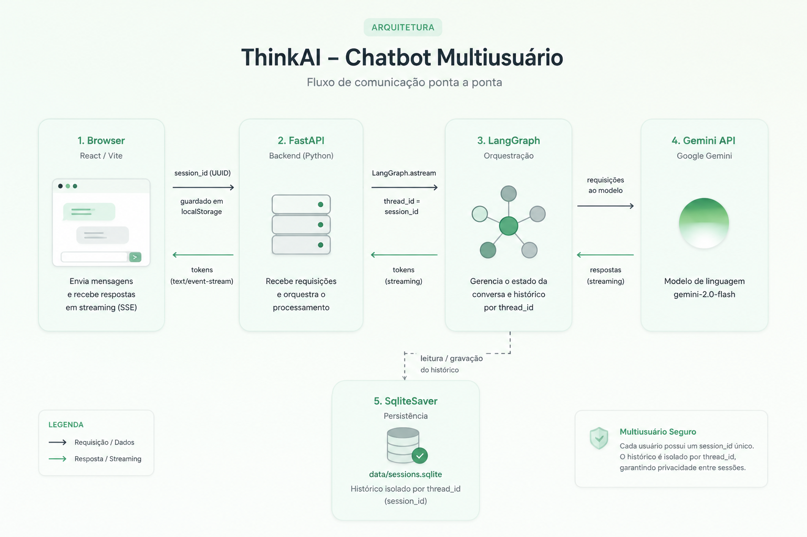

# ThinkAI — Chatbot multiusuário (estudo)

Protótipo funcional de um chatbot multiusuário, usando **Google Gemini** como LLM
e **LangGraph** para orquestração com histórico isolado por sessão.

| Camada    | Stack                                                    | Gerenciador |
| --------- | -------------------------------------------------------- | ----------- |
| `web/`    | React + TypeScript + Vite                                | **bun**     |
| `api/`    | Python + FastAPI + LangGraph + `langchain-google-genai`  | **uv**      |
| LLM       | Google Gemini · modelo `gemini-2.0-flash` (API gratuita) | —           |
| Histórico | LangGraph `SqliteSaver` (`thread_id = session_id`)       | —           |

---

## Como funciona (arquitetura)



- **Multiusuário:** o backend é assíncrono; cada requisição carrega seu `session_id`.
- **Isolamento:** o histórico é guardado por `thread_id = session_id`, então cada resposta volta apenas para a sessão correta.
- **Persistência:** o histórico sobrevive a reinícios do servidor (PostgreSQL containerizado).

---

## Pré-requisito: chave da API Gemini

Obtenha gratuitamente em <https://aistudio.google.com/app/apikey> (conta Google).
O tier gratuito oferece **1.500 requisições/dia** e **15 req/min** — mais que suficiente.

---

## Rodando localmente (desenvolvimento)

Pré-requisitos: [uv](https://docs.astral.sh/uv/) e [bun](https://bun.sh).

### 1. Backend (`api/`)
```bash
cd api
cp .env.example .env
# edite .env e preencha: GEMINI_API_KEY=sua_chave_aqui
uv sync
uv run uvicorn app.main:app --reload --port 8000
```

### 2. Frontend (`web/`)
```bash
cd web
cp .env.example .env   # VITE_API_URL=http://localhost:8000
bun install
bun run dev            # http://localhost:5173
```

Abra <http://localhost:5173>, envie uma mensagem e veja a resposta em streaming.
Use o botão 🌙/☀️ no topo para alternar entre claro e nocturne.

---

## Rodando com Docker (tudo junto)

```bash
# Na raiz do projeto:
cp .env.example .env
# edite .env e preencha: GEMINI_API_KEY=sua_chave_aqui

docker compose up -d --build
```

- Web: <http://localhost> (porta 80)
- API: <http://localhost:8000>

---

## Documentação do endpoint (API)

Base URL local: `http://localhost:8000`

### `GET /health`
Verifica se a API está no ar.
```bash
curl http://localhost:8000/health
# {"status":"ok","model":"gemini-2.0-flash"}
```

### `POST /session`
Cria uma nova sessão e devolve um **ID único** (UUID). O frontend guarda esse ID em
`localStorage` e o reenvia em cada mensagem.
```bash
curl -X POST http://localhost:8000/session
# {"session_id":"bb98ab08-883c-41fb-a460-b52cbe41dacc"}
```

### `POST /chat`
Envia uma mensagem e recebe a resposta em **streaming (SSE)**. Cada evento é uma linha
`data: <pedaço de texto>`; o fim é sinalizado por `data: [DONE]`. Quebras de linha vêm
escapadas como `\n`.

Corpo (JSON):
```json
{ "session_id": "<uuid>", "message": "Sua pergunta aqui" }
```
Exemplo:
```bash
curl -N -X POST http://localhost:8000/chat \
  -H "Content-Type: application/json" \
  -d '{"session_id":"<uuid>","message":"Explique o que é uma API REST"}'
```

Exemplo no browser (consumindo o stream):
```js
const res = await fetch("http://localhost:8000/chat", {
  method: "POST",
  headers: { "Content-Type": "application/json" },
  body: JSON.stringify({ session_id, message: "Olá!" }),
});
const reader = res.body.getReader();
const dec = new TextDecoder();
let buf = "";
while (true) {
  const { value, done } = await reader.read();
  if (done) break;
  buf += dec.decode(value, { stream: true });
  for (const part of buf.split("\n\n")) {
    if (!part.startsWith("data:")) continue;
    const txt = part.slice(5).trim();
    if (txt === "[DONE]") break;
    console.log(txt.replace(/\\n/g, "\n"));
  }
}
```

### `GET /history/{session_id}`
Retorna o histórico persistido de uma sessão.
```bash
curl http://localhost:8000/history/<uuid>
# {"session_id":"...","messages":[{"role":"user","content":"..."},{"role":"assistant","content":"..."}]}
```

> Documentação interativa (Swagger) disponível em `http://localhost:8000/docs`.

---

## Demonstrando o histórico isolado por sessão

Cada usuário recebe um `session_id` (UUID) e o histórico é guardado por `thread_id = session_id`
no `SqliteSaver`. Há duas formas práticas de demonstrar o isolamento:

### A) Pelo navegador (multiusuário real)
O `session_id` fica no `localStorage`, então **cada navegador/janela anônima é um usuário diferente**:
1. Abra <http://localhost:5173> no navegador normal e diga: *"Meu nome é Ana"*.
2. Abra a mesma URL numa **janela anônima** (ou outro navegador/dispositivo) e pergunte: *"Qual é o meu nome?"*.
3. A primeira sessão lembra "Ana"; a segunda **não sabe** — históricos isolados.
4. Recarregar a página mantém a conversa (o ID persiste e o histórico vem de `/history`).

> Para simular vários usuários simultâneos a partir de um mesmo navegador, basta usar abas anônimas
> distintas — cada contexto anônimo tem seu próprio `localStorage` e, portanto, seu próprio `session_id`.

### B) Por script (reproduzível, via API)
Com a API rodando, execute o roteiro pronto que cria duas sessões e comprova o isolamento:
```bash
./scripts/demo_sessions.sh
# ou apontando para outra URL:
API_URL=http://SEU_IP_PUBLICO:8000 ./scripts/demo_sessions.sh
```
Saída esperada (resumo): a sessão **A** aprende e lembra o nome/cor; a sessão **B**, com outro
`session_id`, não tem acesso a esses dados, e `GET /history` mostra os históricos separados.

---

## Deploy na AWS EC2 (público)

Com Gemini, qualquer instância EC2 serve — inclusive o **free tier** (`t2.micro`, 1 GB RAM).

### Passo a passo

1. **Criar a instância**
   - AMI: Ubuntu Server 24.04 LTS · Tipo: **t2.micro** (free tier) ou superior · Disco: 8 GB gp3.
   - Crie/baixe um **key pair** (`.pem`).
   - **Security Group** — libere: `22` (SSH, só seu IP), `80` (HTTP), `8000` (API).

2. **Conectar e instalar Docker**
   ```bash
   ssh -i sua-chave.pem ubuntu@SEU_IP_PUBLICO
   sudo apt update && sudo apt install -y docker.io docker-compose-plugin git
   sudo usermod -aG docker ubuntu && newgrp docker
   ```

3. **Clonar e subir**
   ```bash
   git clone <URL_DO_SEU_REPO> thinkai && cd thinkai

   # Crie o .env com sua chave Gemini:
   echo "GEMINI_API_KEY=sua_chave_aqui" > .env

   # Aponte o frontend para o IP público da EC2:
   sed -i "s#VITE_API_URL: http://localhost:8000#VITE_API_URL: http://SEU_IP_PUBLICO:8000#" docker-compose.yml

   docker compose up -d --build
   ```

4. **Acessar (endpoint público)**
   - Página: `http://SEU_IP_PUBLICO`
   - API: `http://SEU_IP_PUBLICO:8000` (ex.: `curl http://SEU_IP_PUBLICO:8000/health`)

5. **Economizar:** ao terminar o estudo, **pare** a instância no console
   (EC2 → Instâncias → *Stop instance*). Instância parada não gera custo de computação.
   Use um **Elastic IP** se quiser fixar o IP público (grátis enquanto associado a uma instância em execução).

---

## Estrutura do projeto

```
estudo-chatbot/
├─ api/                  # Backend (uv)
│  └─ app/
│     ├─ main.py         # FastAPI: /session, /chat (SSE), /history, /health
│     ├─ graph.py        # Grafo LangGraph (ChatGoogleGenerativeAI + checkpointer)
│     ├─ chat.py         # Streaming SSE e leitura de histórico
│     ├─ config.py       # Settings (.env)
│     └─ schemas.py
├─ web/                  # Frontend (bun)
│  └─ src/
│     ├─ App.tsx
│     ├─ api/client.ts   # createSession / streamChat / fetchHistory
│     ├─ hooks/          # useSession, useChat, useTheme
│     ├─ components/     # Header, Greeting, PromptCards, ChatInput, MessageList...
│     └─ styles/         # theme.css (claro/nocturne) + app.css
├─ scripts/
│  └─ demo_sessions.sh   # Demonstra isolamento de sessões via API
├─ .env.example          # Variáveis para docker-compose
├─ docker-compose.yml    # api + web
└─ README.md
```
