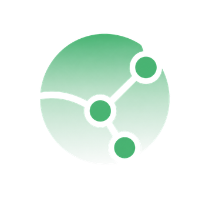
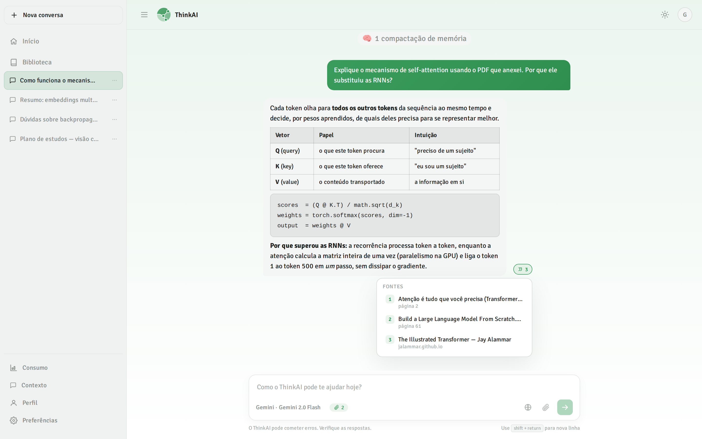
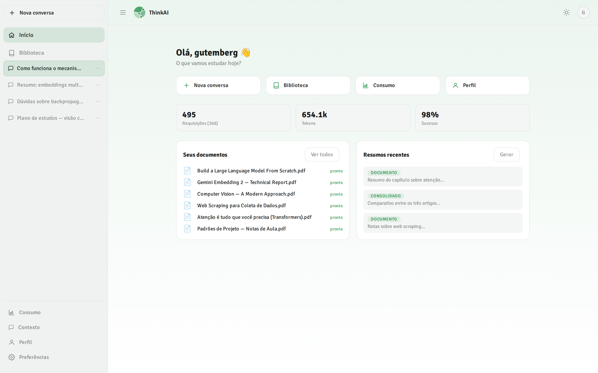
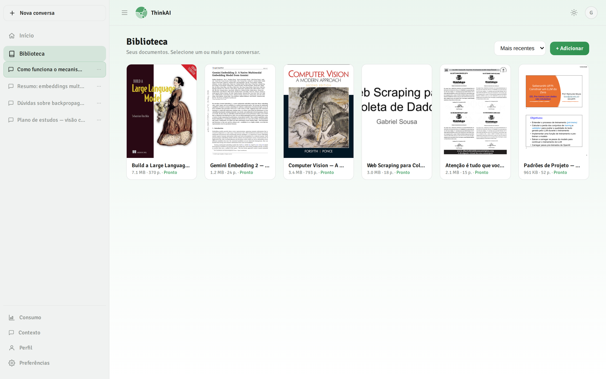
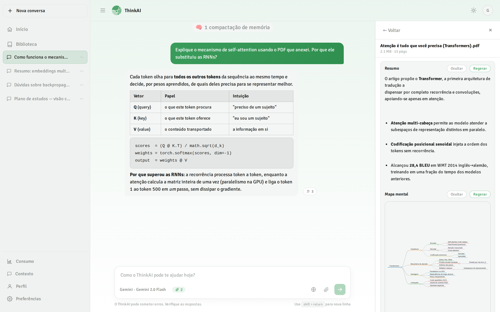
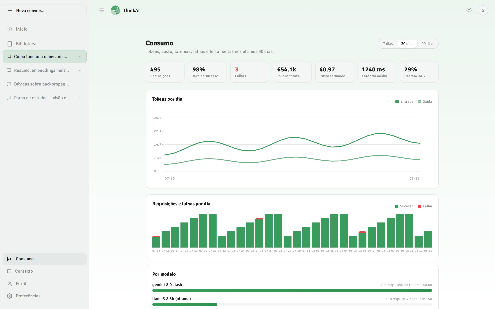
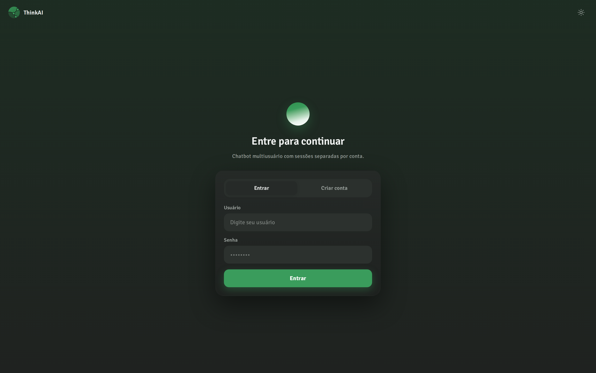
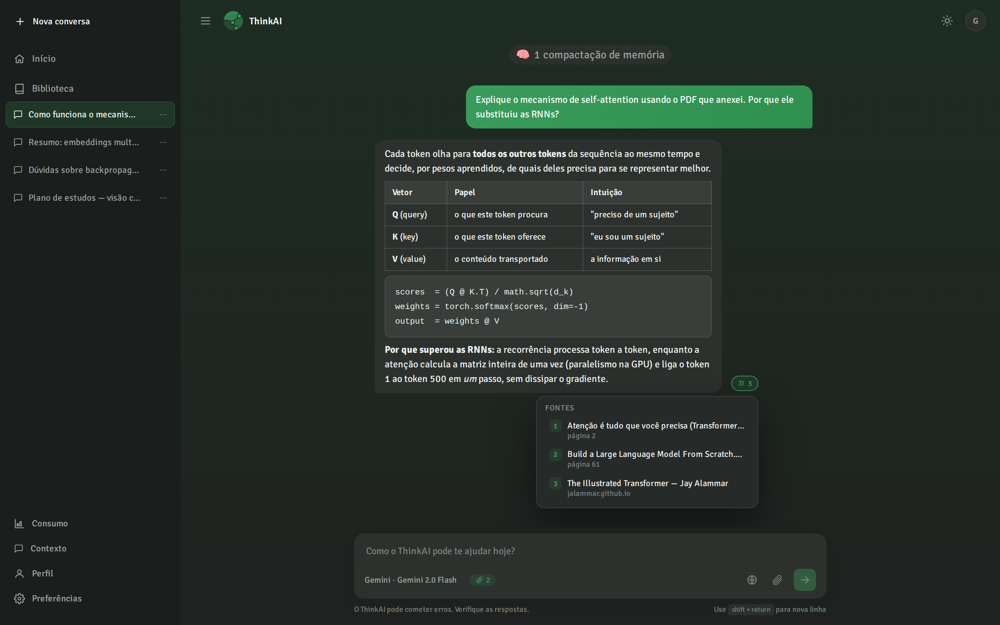
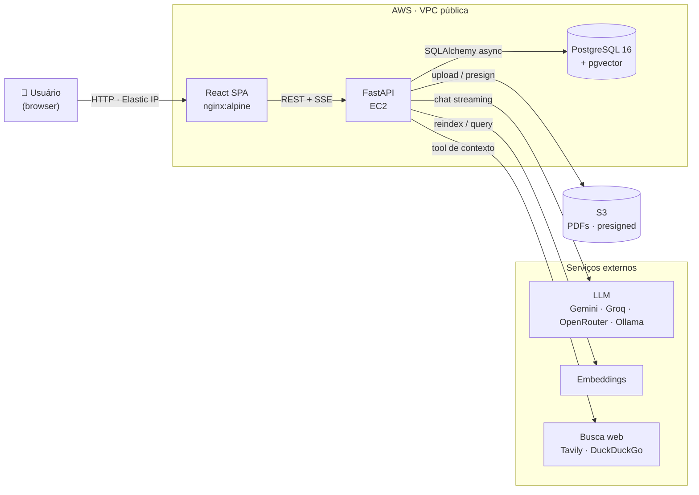
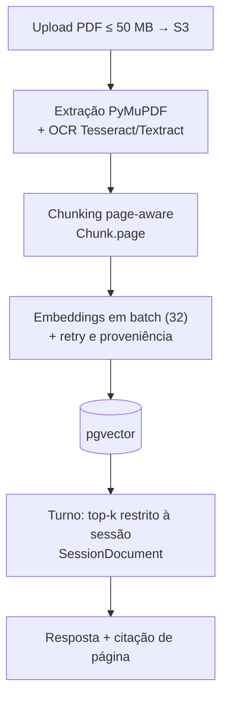

<div align="center">



# ThinkAI

**Chatbot de estudo que conversa com os seus PDFs.**

Upload de documentos, RAG com citação de página, busca web, resumos e mapas
mentais — com gestão da janela de contexto e observabilidade de custo por turno.

[](https://github.com/gutoportelaa/estudo-chatbot/actions/workflows/ci.yml)
[](https://github.com/gutoportelaa/estudo-chatbot/actions/workflows/cd.yml)


</div>

<div align="center">
  
  <sub><i>Resposta gerada a partir dos PDFs do usuário, com as fontes e a página de origem de cada trecho.</i></sub>
</div>

---

## O que ele faz

|  | Recurso | Como funciona |
|---|---|---|
| 📄 | **Biblioteca de PDFs** | Upload com fila e progresso real, capa gerada do documento, extração de texto (PyMuPDF + OCR) |
| 🔍 | **RAG com citação de página** | Chunking *page-aware* → embeddings → pgvector; a resposta aponta o documento **e a página** |
| 🌐 | **Busca web** | Tavily, com fallback DuckDuckGo quando não há chave |
| 🧠 | **Memória gerenciada** | Sumarização híbrida do histórico com orçamento de tokens por bloco |
| 🗺️ | **Resumos e mapas mentais** | Resumo por documento, resumo consolidado de vários PDFs e mapa mental (Markmap) |
| 📊 | **Observabilidade** | Tokens, custo estimado, latência, taxa de sucesso e falhas por modelo |
| 🔐 | **Multiusuário** | JWT; conversas e documentos isolados por conta e escopados por conversa |

---

## Telas

<table>
<tr>
<td width="50%">

<b>Início</b><br/><sub>Acessos rápidos, documentos e resumos recentes, resumo de consumo.</sub>
</td>
<td width="50%">

<b>Biblioteca</b><br/><sub>Capa gerada do PDF, ordenação e seleção para conversar sobre os documentos.</sub>
</td>
</tr>
<tr>
<td width="50%">

<b>Resumo e mapa mental</b><br/><sub>Clicar numa citação abre o documento no trecho de origem, com resumo e Markmap.</sub>
</td>
<td width="50%">

<b>Consumo</b><br/><sub>Tokens, custo, latência e falhas por período e por modelo.</sub>
</td>
</tr>
<tr>
<td width="50%">

<b>Autenticação</b><br/><sub>Sessões separadas por conta, via JWT.</sub>
</td>
<td width="50%">

<b>Tema <i>nocturne</i></b><br/><sub>Claro/escuro com cor de destaque configurável.</sub>
</td>
</tr>
</table>

---

## Stack

| Camada | Stack | Gerenciador |
| --- | --- | --- |
| `web/` | React + TypeScript + Vite (SPA state-driven) | **bun** |
| `api/` | Python 3.12 + FastAPI + SQLAlchemy async + Alembic | **uv** |
| LLM | Gemini (ADK) · Groq / OpenRouter / **Ollama** (OpenAI-compat) | — |
| Embeddings | Ollama (dev) · Gemini / **OpenRouter** (prod) | — |
| Banco | PostgreSQL 16 + **pgvector** | — |
| Nuvem | AWS: VPC + EC2 (API + front via nginx) + S3 | — |

---

## Arquitetura


```mermaid
flowchart LR
    user["👤 Usuário<br/>(browser)"]

    subgraph aws["AWS · VPC pública"]
        web["React SPA<br/>nginx:alpine"]
        api["FastAPI<br/>EC2"]
        db[("PostgreSQL 16<br/>+ pgvector")]
    end

    s3[("S3<br/>PDFs · presigned")]

    subgraph ext["Serviços externos"]
        llm["LLM<br/>Gemini · Groq · OpenRouter · Ollama"]
        embed["Embeddings"]
        search["Busca web<br/>Tavily · DuckDuckGo"]
    end

    user -->|"HTTP · Elastic IP"| web
    web -->|"REST + SSE"| api
    api -->|"SQLAlchemy async"| db
    api -->|"upload / presign"| s3
    api -->|"chat streaming"| llm
    api -->|"reindex / query"| embed
    api -->|"tool de contexto"| search
```

### Um turno de chat (Context Assembler)

Cada turno monta o contexto dentro de um orçamento de tokens, e as ferramentas
negociam a cota entre si antes da chamada ao modelo:

```mermaid
flowchart TD
    msg["Usuário envia mensagem<br/>POST /chat · SSE"] --> budget["Context Assembler abre<br/>orçamento de tokens do modelo"]
    budget --> system["Bloco system<br/>prompt do agente"]
    system --> summary["Bloco resumo do histórico<br/>sumarização híbrida"]
    summary --> tools["Ferramentas negociam cota<br/>RAG top-k por sessão + busca web"]
    tools --> recent["Bloco janela recente<br/>N mensagens verbatim"]
    recent --> call["Chama LLM → streaming de tokens"]
    call --> persist["Persiste Message + sources<br/>+ TurnMetric (tokens/custo/status)"]
```

### Pipeline RAG (upload → citação de página)


```mermaid
flowchart TD
    upload["Upload PDF ≤ 50 MB → S3"] --> extract["Extração PyMuPDF<br/>+ OCR Tesseract/Textract"]
    extract --> chunk["Chunking page-aware<br/>Chunk.page"]
    chunk --> embed["Embeddings em batch (32)<br/>+ retry e proveniência"]
    embed --> store[("pgvector")]
    store --> query["Turno: top-k restrito à sessão<br/>SessionDocument"]
    query --> answer["Resposta + citação de página"]
```

> Os mesmos diagramas em formato `diagram-spec` (JSON descritivo, para renderizar
> como imagem via LLM) estão em [`docs/CONTEXT.md`](docs/CONTEXT.md); o diagrama-fonte
> renderizado fica em [`docs/diagrama_thinkai.png`](docs/diagrama_thinkai.png).

---

## Rodando localmente

Pré-requisitos: [uv](https://docs.astral.sh/uv/), [bun](https://bun.sh) e Docker
(para o Postgres + pgvector). Detalhes em [`docs/inicializacao-local.md`](docs/inicializacao-local.md).

**1. Banco**
```bash
docker compose up -d db     # pgvector/pgvector:pg16
```

**2. Backend (`api/`)**
```bash
cd api
cp .env.example .env        # ajuste LLM_PROVIDER, chaves e DATABASE_URL
uv sync
uv run alembic upgrade head
uv run uvicorn app.main:app --reload --port 8001
```

**3. Frontend (`web/`)**
```bash
cd web
cp .env.example .env        # VITE_API_URL=http://localhost:8001
bun install
bun run dev                 # http://localhost:5173
```

> **Sem chave de API:** use `LLM_PROVIDER=ollama` e `EMBEDDING_PROVIDER=ollama`
> (com o [Ollama](https://ollama.com) rodando `llama3.2:3b`) para desenvolver
> 100% offline. A busca web cai no fallback DuckDuckGo sem `TAVILY_API_KEY`.

### Tudo junto com Docker

```bash
cp .env.example .env        # preencha as chaves do provedor escolhido
docker compose up -d --build
```
Web em <http://localhost> (porta 80) · API em <http://localhost:8001>.

---

## Testes

```bash
cd api && uv run pytest     # ~76 testes (SQLite em memória, sem rede)
```

CI (`.github/workflows/ci.yml`): a cada push/PR roda ruff + pytest (backend) e
`tsc --noEmit` + build (frontend), bloqueando merge em caso de falha. Cobertura de
ambientes de teste (local/rede e AWS) documentada em
[`docs/CONTEXT.md`](docs/CONTEXT.md#testes-e-ambientes-de-teste).

---

## Deploy na AWS

Guia completo (VPC, Security Groups, S3/IAM, EC2, CI/CD e checklist de aceitação da
banca) em **[`docs/aws-runbook.md`](docs/aws-runbook.md)**.

**O que está de fato em produção hoje:** uma única EC2 pública roda os três
containers do `docker-compose.yml` — `db` (Postgres+pgvector), `api` (FastAPI) e
`web` (nginx:alpine servindo o build do React). O S3 guarda os PDFs via IAM Role
(sem chave no disco). O CD (`.github/workflows/cd.yml`) faz
SSH → `git pull` → `docker compose pull/up` → health check ao promover `dev → main`.

**S3+CloudFront para o frontend é uma opção documentada, não provisionada.** Existe
um workflow pronto (`frontend-deploy.yml`), mas ele só roda se a repo var
`ENABLE_FRONTEND_DEPLOY=true` for setada — hoje não está, então o job fica
*skipped* e o frontend continua sendo servido pela própria EC2 via nginx.

---

## Isolamento por usuário e por conversa

Autenticação **JWT**; cada sessão de chat pertence a um usuário e o histórico é
persistido no Postgres por sessão. O RAG é escopado por conversa
(`SessionDocument`): documentos anexados a uma conversa não vazam para outra.
Roteiro reproduzível:

```bash
./scripts/demo_sessions.sh
```

---

## API

Swagger interativo em `http://localhost:8001/docs`. Grupos de rotas:

| Grupo | Rotas |
|---|---|
| `auth` | signup, signin, perfil, avatar |
| `chat` | `/chat` (SSE), sessões, contexto, sumarizações |
| `documents` | upload, raw, thumbnail, extract, index, summary, mindmap |
| `summaries` | resumo consolidado de vários documentos |
| `metrics` | `/metrics/usage` |

---

## Documentação

| Documento | Conteúdo |
|---|---|
| [`docs/CONTEXT.md`](docs/CONTEXT.md) | **Evolução completa** do projeto por etapas, decisões técnicas, arquitetura, diferenças em relação ao planejamento, testes e ambientes |
| [`docs/aws-runbook.md`](docs/aws-runbook.md) | Bootstrap da infra AWS (VPC/SG/S3/IAM/EC2), custos e checklist de aceitação |
| [`docs/inicializacao-local.md`](docs/inicializacao-local.md) | Bring-up local (Postgres 5433 + Alembic) |
| [`docs/decisoes-janela-contexto.md`](docs/decisoes-janela-contexto.md) | Relatório técnico do épico de gestão de contexto (#30–#37) |

A árvore anotada de diretórios e a descrição de cada módulo estão em
[`docs/CONTEXT.md`](docs/CONTEXT.md#estrutura-de-diretórios).
